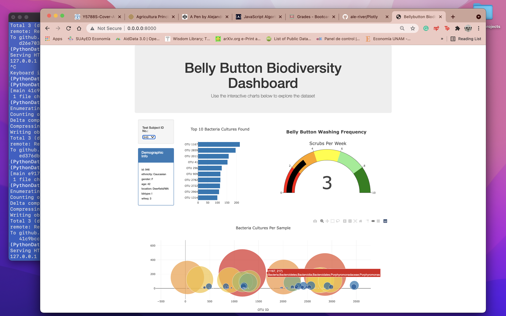

# ***Plotly & Belly Button Biodiversity :cyclone:

This project has the intention to create a dashboard where are included the four deliverables below:
- Deliverable 1: Create a Horizontal Bar Chart
- Deliverable 2: Create a Bubble Chart
- Deliverable 3: Create a Gauge Chart
- Deliverable 4: Customize the Dashboard

The source of data comes from a completed panel of demographic information where is visualized the bacterial data for each volunteer. The volunteers should be able to identify the top 10 bacterial species in their belly buttons.
The resources to be considered for the analysis are:
1. Data Source: `script.js`, `plots.js` and `index.html`.
2. Data Tools: ECMAScript, JavaScript, JSON and IO (Web Server)
3. Software: ES6+, ECMAScript and Visual Studio Code 1.56.2

Note: For security reasons, a local server must be run when loading an external file into a JavaScript script file.
Write in Terminal or Bash: `python -m http.server` and you should see a message in the command line like this:
`Serving HTTP on 0.0.0.0 port 8000 (http://0.0.0.0:8000/) ...`
This would help to navigate in the browser: `localhost:8000`

**To bypass this CORS error message, we navigated to the directory where index.html is located and ran python -m http.server in the CLI.
CORS stands for [Cross-Origin Resource Sharing](https://developer.mozilla.org/en-US/docs/Web/HTTP/CORS). In short, browsers by default do not permit reading of resources from multiple sources. This restriction is in place because of security concerns.
To better understand the issue, we first need to define servers. A server is a program or device that performs actions such as processing and sharing data. Our discussion will be limited to servers in the sense of software programs.**
> Washington University in St. Louis, Data Anlytics Bootcamp

## ***Overview of Project 

From the external JSON file named `data.js`, the `script.js` is iterated through objects and retrieve necessary data from them, whether they are object keys or object values. She can also iterate through arrays with methods such as `map()` and `filter()`.
Additionally, it is used a `D3.js` library to create an event listener for a dropdown menu.

During the test, the module used a line chart to choose datasets 1 or 2 in order to learn how D3 works :)

In short, the JSON SCRIPT shows the blocks of code in the following way for the testing data:

EXAMPLE OF JUMBOTRON AND DROPDOWN MENU IN JSON -> SCRIPT FOR TESTING

EXAMPLE OUTCOME TO TEST D3.JSON AND WEB SERVER -> SCRIPT FOR TESTING

## ***Results :dart:
Using the knowledge of JavaScript, Plotly, and D3.js, create a horizontal bar chart to display the top 10 bacterial species (OTUs) when an individual’s ID is selected from the dropdown menu on the webpage. The horizontal bar chart will display the sample_values as the values, the otu_ids as the labels, and the otu_labels as the hover text for the bars on the chart.
By looking for subject ID, we can identify the OTU in descending order. The scrub chart mentions the frequency washing period of each person in the sample. Finally, the bubble chart shows the bacteria culture type per sample.

*Belly Button Biodiversity Dashboard

## ***Summary
The dashoboard is able to show the information by doing a background color or a variety of compatible colors to the webpage. It uses a custom font with contrast for the colors.
The project includes the information about what each graph visualizes, either under or next to each graph.
Finally, the navigation bar allows to select the bar or bubble chart on the page.